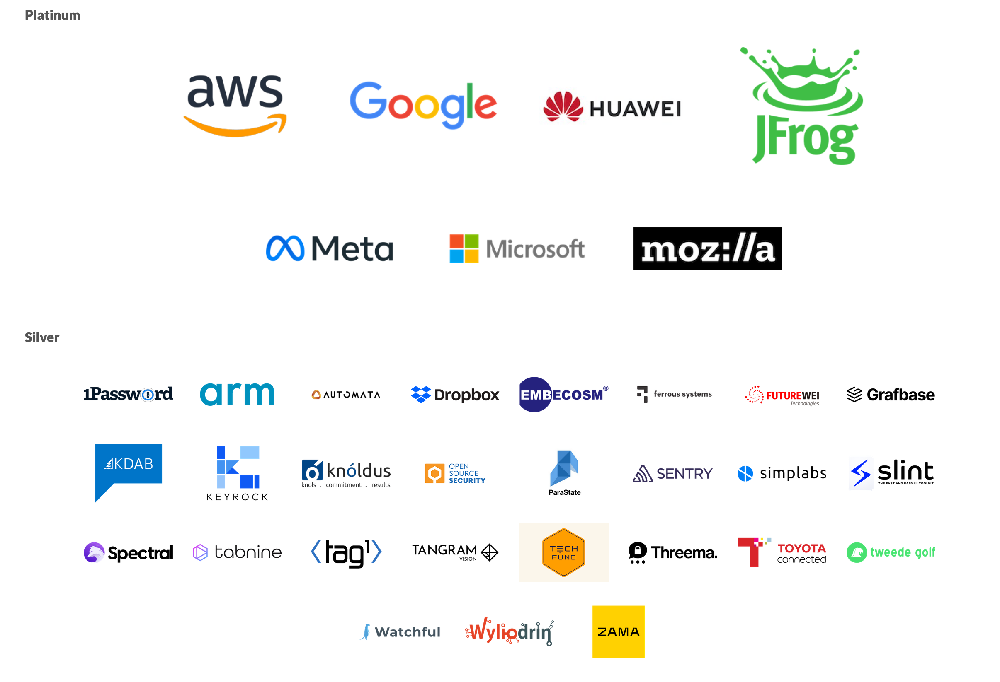
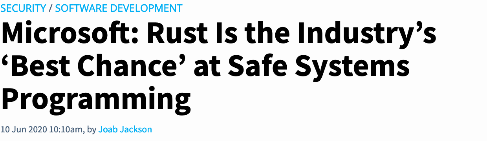
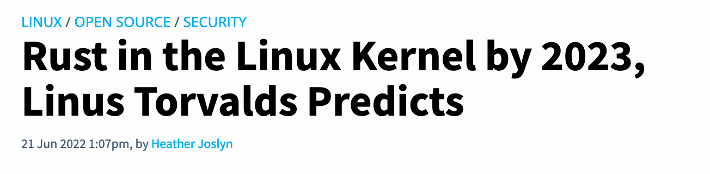
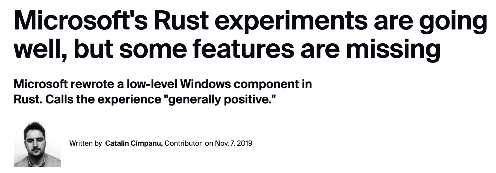
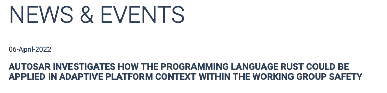
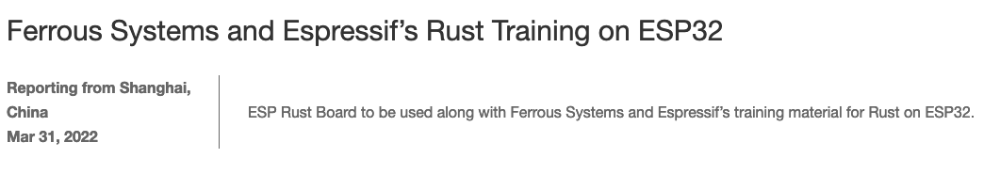
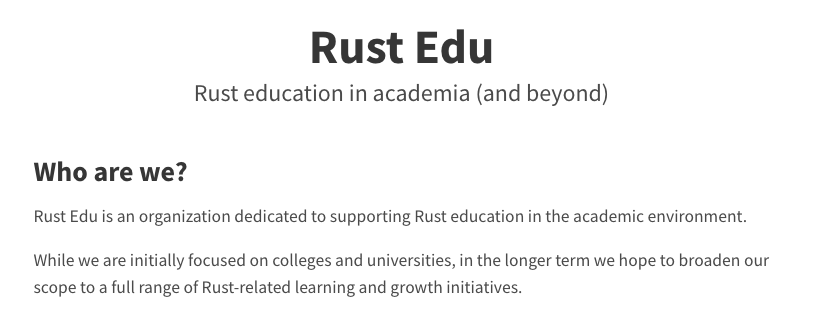
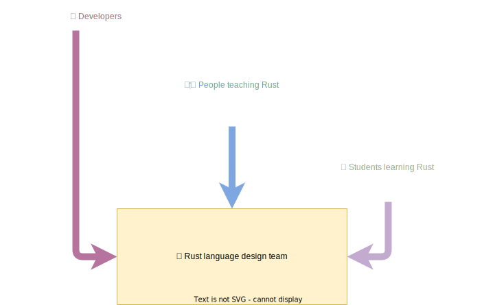

class: center
name: title
count: false
background-image: url(images/powerpoint-start.png)
background-size: contain

.left[.citation[View slides at `https://nikomatsakis.github.io/iFood-Tech-Day-2022/`]]

---

# Who is this guy

.text300[👋🏽 Hi!]

* Senior Principal Engineer at AWS
* Been working on Rust since 2011
* Co-lead of the Rust language design team

---

# Rust sprouting up all over

.center[.p80[]]

... and those are just the foundation sponsors.

---

# Rust as the foundational layer

* Cloud providers like AWS, Microsoft, Google, Fastly, Cloudflare, etc

--


.p60[]

.citation[
    `https://aws.amazon.com/blogs/opensource/why-aws-loves-rust-and-how-wed-like-to-help/` <br/>
    `https://www.zdnet.com/article/microsofts-rust-experiments-are-going-well-but-some-features-are-missing/`
]

---

# Rust as the foundational layer

* Operating system kernels

--

.p60[]

.p60[]

.citation[
    `https://thenewstack.io/rust-in-the-linux-kernel-by-2023-linus-torvalds-predicts/` <br/>
    `https://www.zdnet.com/article/microsofts-rust-experiments-are-going-well-but-some-features-are-missing/`
]

---

# Rust as the foundational layer

* Embedded, IoT

--

.p60[]

.p60[]

.citation[
  `https://www.autosar.org/news-events/details/autosar-investigates-how-the-programming-language-rust-could-be-applied-in-adaptive-platform-context/` <br>

  `https://www.espressif.com/en/news/ESP_RUST_training`
]
---

# Rust as the foundational layer

Stuff like...

* Cloud providers like AWS, Microsoft, Google, Fastly, Cloudflare, etc
* Operating system kernels
* Embedded, IoT

--

...but also:

* Your web service that moves a lot of traffic, actually.
* The core logic of your mobile app that you'd like to share between Android and iOS.
* Development tools that need to run fast. 

---

# Why work on Rust?

???

Why work on Rust for so long?

Do I just hate garbage collectors?

--


???

No, though I do think they have a tendency to make a mess.

---

# Why work on Rust?

???

I love Rust because I like to see people cool stuff, and Rust is great at that.

---

# Why work on Rust?

???

I love Rust because I like to see people cool stuff, and Rust is great at that.

--


???

It's right there on our page: Rust is a tool for helping everyone to build
reliable and efficient software. And what could be more rewarding than that?

There's a lot packed into this To start with, the phrase *empowering everyone*
refers to the fact that Rust aims to broaden the pool of people doing systems
programming. We want to get past the idea of *systems programming wizards* and build
an accessible tool that can be used by anybody who needs to build a fast, reliable
program. Interestingly, while a lot of Rust's users have a background in C++, there are
also a number of people who jump to Rust from higher-level languages like Python, JavaScript,
or Go, and we're proud of that.

---

# Most folks come for the performance

???

Over the years, I've noticed a trend in how Rust adoption plays out.

People come to Rust because they have a service that is running too slowly.

---

# Most folks come for the performance


.citation[
    `https://discord.com/blog/why-discord-is-switching-from-go-to-rust`
]

???

Take Discord, for instance. In 2020, they ported a service to Rust, from Go.

---

# Most folks come for the performance


.gcpause[]

???

This service was a foundational one for them, which tracked which messages had been read and which had not.

They were having problems with the Go garbage collector, which was inserting collection pauses every so often, causing their peak latency to spike. (In fairness, the Go GC has been updated since the post was written.)

---

# Most folks come for the performance


.rustperf[]

???

They rewrote the service in Rust and were able to achieve the smooth, uniform latency they were looking for.

---

# But Rust let them do more

> We no longer had to deal with garbage collection, so we figured we could raise the cap of the cache and get even better performance. (...) The results below speak for themselves. **Notice the average time is now measured in microseconds and max @mention is measured in milliseconds**.

.citation[`https://discord.com/blog/why-discord-is-switching-from-go-to-rust` (emphasis mine)]

???

But what happened next is more interesting. Once they had the service running, they were able to tinker with it, boosting performance further. 

This makes sense: making a program fast isn't really a function of programming language. The goal of Rust then is mostly to get out of your way and let you build the architecture you wanted.

---

# But they stay for the productivity

> Along with performance, Rust has many advantages for an engineering team. For example, **its type safety and borrow checker make it very easy to refactor code as product requirements change or new learnings about the language are discovered**. Also, the ecosystem and tooling are excellent and have a significant amount of momentum behind them.

.citation[`https://discord.com/blog/why-discord-is-switching-from-go-to-rust` (emphasis mine)]

???

This wasn't just a one-off thing. As time went on, they found that maintaining their code was easier with Rust. They say it was "very easy to refactor code as product requirements change". They were able to move faster.

---

# It's not just discord

pinecone.io:

> What we didn’t expect was the extent to which dev velocity increased and operational incidents decreased. **Dev velocity**, which was supposed to be the claim to fame of Python, **improved dramatically with Rust**. \[..\] Most impressively though, **real time operational events dropped almost to zero** overnight after the original release. Sure, there are still surprises here and there but, by and large, the core engine has been shockingly stable and predictable.

.citation[`https://www.pinecone.io/learn/inside-the-pinecone/#rust-a-hard-decision-pays-off` (emphasis mine)]

???

It's not just discord. Here is pinecone.io, talking about how they ported from C++/Python to using Rust. They found that it increased their development velocity overall. Furthermore, they no longer had to deal with annoying late-night pages.

---

# It's not just pinecone

cultivatehq.com:

> "Rust allowed the experienced developers to move fast and develop features quickly with less errors, and allowed those exploring systems development for the first time to **move forward with confidence, curiosity and protection** from the "gotchas" of C/C++."

.citation[`https://cultivatehq.com/posts/how-we-built-a-visual-studio-code-extension-for-iot-prototyping/` (emphasis mine)]

???

Here's a post from cultivatehq: same thing. Rust let them move forward with confidence.

---

# How Rust adoption typically works

* Start by porting some performance critical piece of infra
* Find that it is fast *and* maintainable
* Start using Rust for more and more things

---

# What makes Rust so productive?

It's a lot of things.

Tooling is huge: cargo, crates.io, careful error messages.

--

Great frameworks and libraries.

--

But also: a strict (and sometimes annoying) type system!

--

.center[
  .p40[]
]

---

# Safety == spinach

.p60[]

.citation[Image credit: Clyde Robinson `https://flickr.com/photos/crobj/3184283013/`]

---

background-image: url(images/popeye1.jpg)
background-size: contain

.white-text[
# Safety == POPEYE spinach!
]

.white-text[.citation[
Image credit: Salim Virji `https://www.flickr.com/photos/salim/8594532469/`
]]

---

# A common sensation

.center[.p80[]]

???

Without a strong type system, it's really easy to build yourself a beautiful looking program, get everything setup, and then find that it goes down the second you put it into production.

---

# Bugs not possible in Rust

* Segfaults, double frees -- scary C stuff

???

But a strong type system helps. 
And it's not just about garbage collection.

Rust's type system rules out segfaults and double frees, which are the kinds of bugs you hit in C code.

But it also rules out null pointer exceptions and data races, both pretty common in Java or Go.

--
* Null pointer exceptions

--
* Data races

---

# This could be you

.center[.p80[]]

???

Strong type systems do require more investment up front. 
You have to learn how they work.
But once you've got that, you find that the things you build actually work the way they're supposed to, often the first time.

---

# Full disclosure time

.center[]

???

But let's be honest. Rust's type system may be great, but it takes time to learn.

And it's not a great fit for everything. Your code can sometimes wind up having to "work around" the type system rather than benefit from it.

---

# Journey to loving Rust

Most folks take 3-6 months to learn Rust.

At first, it's ridiculously frustrating.

At some point, you turn the corner, and -- for many of us -- it's hard to imagine using another language.

???

My experience is that it takes folks about 3-6 months to learn Rust,
although it really depends on the individual.

---

# OMG so perfect

<br/>
<br/>
<br/>

<q>Rust: the language where you get the hangover first</q>

-- Old Rust proverb <sup>1</sup>

.citation[
  <sup>1</sup> I've yet to find the origin of this quote.<sup>2</sup> <br/>
  <sup>2</sup> Although I have a sneaking suspicion that somebody tweeted it at me and I forgot.
]

---

# Our challenge

* Keep the benefits, lose the hangover


* Stay true to Rust's soul: reliability, performance, transparency
* While improving Rust's supportiveness, productivity, and versatility

???

Our challenge is to find ways to improve Rust's productivity while staying true to the things that make Rust Rust.

It's not always easy. There are a few dangers.

Complacency.

Overreach and leaky abstractions.

Goal: incremental progress. Find our way.

---

# Another challenge: being bold

<q>Avoid success at all costs</q>

-- Unofficial Haskell slogan

???

Haskellers often say they wish to "avoid success at all costs".

Why? Because they want the freedom to keep innovating.

With success comes the problems of backwards compatibility and the challenges of satisfying an existing set of users.

Rust has achieved success. But I still want us to soar.

How do we do that? Part of is that we have to *be bold*.

Just because something seems hard, or because we've always done it that way, doesn't mean we should.

I'm going to give a few examples of hard problems in this talk -- ones that I think are controversial, but which have real impact on Rust's users.

---

# Improving the borrow checker

* Rust 2015: "Lexical lifetimes"
* Rust 2018: "Non-lexical lifetimes" (NLL)
* Rust 2021: Improved closures

--
* Rust 2024: Polonius

---

# Rust 2015: Lexical lifetimes

```rust
fn 
```

---

# What polonius permits

---

# Rust learning curve

Q: When is a Rust user most open to learning how Rust works?

--
* When they're reading the Rust book for the first time?

--
* Once they know things work?

---

# Rust learning curve

Q: When is a Rust user most open to learning how Rust works?

A: when they hit a compiler error!

```
error: return types are denoted using `->`
 --> src/main.rs:1:21
  |
1 | fn meaning_of_life(): u32 { 42 }
  |                     ^ help: use `->` instead
```

---

# Rust learning curve

Q: What is the first thing a Rust user has to know to understand the error?

--
* The Rust type system?

--
* Ownership and borrowing

---

# Rust learning curve

Q: What is the first thing a Rust user has to know to understand the error?

A: English.

---

# Diagnostic translation effort

.p40[]

```
error: el tipo de retorno se debe indicar mediante `->`
 --> src/main.rs:1:21
  |
1 | fn meaning_of_life(): u32 { 42 }
  |                     ^ ayuda: utilice `->` en su lugar
```

.citation[
  Shoutout to David Wood and the folks from Diagnostics Working Group driving this effort.<br/>
  Read more at https://blog.rust-lang.org/inside-rust/2022/08/16/diagnostic-effort.html.
]

---

# Helping people learn in other ways

.center[.p80[]]

---

# Learning more about how people learn Rust?



---

# Being bold: Telemetry?

* It would be really useful if we knew
  * what error codes people hit
  * what they do in response to those errors
  * how many people are hitting a bug that was just reported
* But:
  * If we were to do this, have to be careful to respect privacy

---

# Async Rust

Async-await shipped in 2019...

```rust
async fn send_message(
  input: Reader,
  output: Writer,
) -> io::Result<()> {
  let data = input.read_data().await?;
  output.write_data(data).await?;
}
```

...and it's sparked an explosion in network-related Rust apps.

---

name: async-needs-work

# Async Rust needs work

```rust
trait Iterator {
  type Item;

  fn next(&mut self) -> Option<Self::Item>;
}
```

---
template: async-needs-work

.line2[]

---
template: async-needs-work

.line4[]

---

# Async Rust needs work

```rust
trait Iterator {
  type Item;

  fn next(&mut self) -> Option<Self::Item>;
}
```

Q: What does the async version of the `Iterator` trait look like?

---

# Async Rust needs work

A: There isn't one! Because async doesn't work in traits.

---

# Async fns in traits

```rust
pub trait AsyncIterator {
    type Item;

    async fn next(&mut self) -> Option<Self::Item>;
}
```

This is what we are shooting for.

.line4[]

---

# Async fns in traits

Current status:

* ✅ Design: approaching completion
* ✏️ Implementation: ongoing
* ⌛ Stablization: next year

.citation[
  Shoutout to Tyler Mandry, who worked on the design with me,
  as well as Santiago Pastorino, Eric Holk, Michael Goulet,
  but also Jack Huey for his work on GATs and Oli Scherer for
  his work on TAITs. It takes a village.
]


---

# Other async Rust language features


.citation[
  <sup>1</sup> The code that runs when a variable goes out of scope (aka, destructors).
]

* Goal: use async/await anywhere you write code
  * ✅ top-level async fns
  * ✏️ async fn in traits
  * ⌛ async drop<sup>1</sup>
  * ⌛ async closures

--
  * 🤔 in iterator chains?

---

name: iterator-chain

# Iterator chains?

```rust
fn find_element(data: &[Data]) -> Result {
  x.iter()
      .filter(|datum| datum.is_valid())
      .map(|datum| datum.intermediate_result())
      .max()
}
```

---

template: iterator-chain

.line2[]

---

template: iterator-chain

.line3[]

---

template: iterator-chain

.line4[]

---

template: iterator-chain

.line5[]

---

# Iterator chains with await

```rust
fn find_element(data: &[Data]) -> Result {
  x.iter()
      .filter(|datum| datum.is_valid())
      .map(|datum| datum.intermediate_result().await)
      .max()
}
```

--

.line4[]

---

# "Color" problem<sup>1</sup>

No way to write a function that *might* be async.

Do we need to make two iterators? 

What if we to support `const fn`, do we need three?

(For folks who know Rust, what about if we want to support `?` -- do we need four?)

.citation[
  <sup>1</sup> The term "color" comes from the classic blog post, ["What color is your function?"](https://journal.stuffwithstuff.com/2015/02/01/what-color-is-your-function/), describing a similar phenomena in JavaScript.
]

---

name: keyword-generics

# Being bold: "keyword" generics

```rust
async<A> fn read_to_string(
  reader: &mut impl Read * A,
) -> std::io::Result<String> {
    let mut string = String::new();
    reader.read_to_string(&mut string).await?;
    string
}
```

Goal: Write code that might be async, might be const, etc.

.citation[
  Led by Yoshua Wuyt and Oli Scherer. Read more: https://blog.yoshuawuyts.com/announcing-the-keyword-generics-initiative/
]

---

template: keyword-generics

.line1[]

---

template: keyword-generics

.line2[]


---

# Conclusion

.center[
  .p40[
    
  ]
]

.center[**Hack without fear!**]

.citation[
  RustConf 2017 artwork owned by [Tilde](https://www.tilde.io/) and licensed under Creative Commons.

  Slogan coined by Felix Klock.
]

---

class: center
name: title
count: false
background-image: url(images/powerpoint-end.png)
background-size: contain
