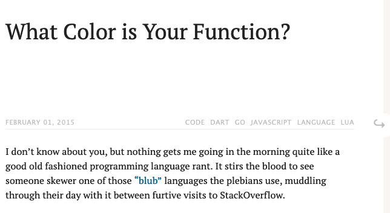
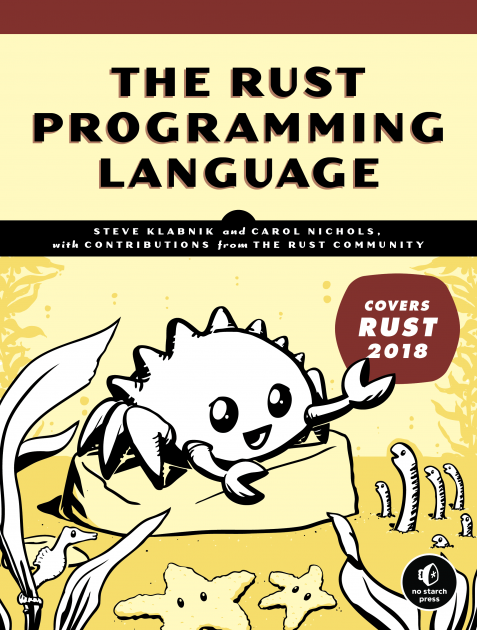
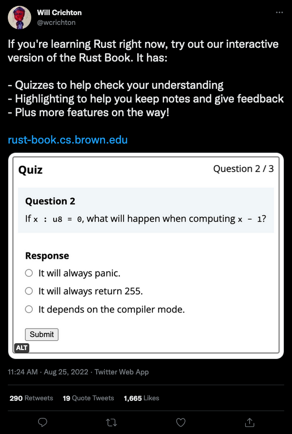

class: center
name: title
count: false
background-image: url(images/powerpoint-start.png)
background-size: contain

.left[.citation[View slides at `https://nikomatsakis.github.io/iFood-Tech-Day-2022/`]]

---

# Who is this guy

.text300[👋🏽 Hi!]

* Senior Principal Engineer at AWS
* Been working on Rust since 2011
* Co-lead of the Rust language design team

---

# Rust sprouting up all over

.center[.p80[]]

... and those are just the foundation sponsors.

---

# Rust as the foundational layer

* Cloud providers like AWS, Microsoft, Google, Fastly, Cloudflare, etc

--


.p60[]

.citation[
    `https://aws.amazon.com/blogs/opensource/why-aws-loves-rust-and-how-wed-like-to-help/` <br/>
    `https://www.zdnet.com/article/microsofts-rust-experiments-are-going-well-but-some-features-are-missing/`
]

---

# Rust as the foundational layer

* Operating system kernels

--

.p60[]

.p60[]

.citation[
    `https://thenewstack.io/rust-in-the-linux-kernel-by-2023-linus-torvalds-predicts/` <br/>
    `https://www.zdnet.com/article/microsofts-rust-experiments-are-going-well-but-some-features-are-missing/`
]

---

# Rust as the foundational layer

* Embedded, IoT

--

.p60[]

.p60[]

.citation[
  `https://www.autosar.org/news-events/details/autosar-investigates-how-the-programming-language-rust-could-be-applied-in-adaptive-platform-context/` <br>

  `https://www.espressif.com/en/news/ESP_RUST_training`
]
---

# Rust as the foundational layer

Stuff like...

* Cloud providers like AWS, Microsoft, Google, Fastly, Cloudflare, etc
* Operating system kernels
* Embedded, IoT

--

...but also:

* Your web service that moves a lot of traffic, actually.
* The core logic of your mobile app that you'd like to share between Android and iOS.
* Development tools that need to run fast. 

---

# Why work on Rust?

???

Why work on Rust for so long?

Do I just hate garbage collectors?

--


???

No, though I do think they have a tendency to make a mess.

---

# Why work on Rust?


???

I love Rust because I like to see people cool stuff, and Rust is great at that.

It's right there on our page: Rust is a tool for helping everyone to build
reliable and efficient software. 

I want to emphasize one part of that slogan: the phrase *empowering everyone* refers to the fact that Rust aims to broaden the pool of people working on these foundational layers. We want to get past the idea of *systems programming wizards* and build an accessible tool that can be used by anybody who needs reliability and efficiency. 

---

# Most folks come for the performance

???

Over the years, I've noticed a trend in how Rust adoption plays out.

People come to Rust because they have a service that is running too slowly.

---

# Most folks come for the performance


.citation[
    `https://discord.com/blog/why-discord-is-switching-from-go-to-rust`
]

???

Take Discord, for instance. In 2020, they ported a service to Rust, from Go.

---

# Most folks come for the performance


.gcpause[]

.citation[
    `https://discord.com/blog/why-discord-is-switching-from-go-to-rust`<br>
    Note that Go GC has been rewritten since these measurements were made.
]

???

This service was a foundational one for them, which tracked which messages had been read and which had not.

They were having problems with the Go garbage collector, which was inserting collection pauses every so often, causing their peak latency to spike. (In fairness, the Go GC has been updated since the post was written.)

---

# Most folks come for the performance


.rustperf[]

.citation[
    `https://discord.com/blog/why-discord-is-switching-from-go-to-rust`<br>
    Note that Go GC has been rewritten since these measurements were made.
]

???

They rewrote the service in Rust and were able to achieve the smooth, uniform latency they were looking for.

---

# But Rust let them do more

> We no longer had to deal with garbage collection, so we figured we could raise the cap of the cache and get even better performance. (...) The results below speak for themselves. **Notice the average time is now measured in microseconds and max @mention is measured in milliseconds**.

.citation[`https://discord.com/blog/why-discord-is-switching-from-go-to-rust` (emphasis mine)]

???

But what happened next is more interesting. Once they had the service running, they were able to tinker with it, boosting performance further. 

This makes sense: making a program fast isn't really a function of programming language. The goal of Rust then is mostly to get out of your way and let you build the architecture you wanted.

---

# But they stay for the productivity

> Along with performance, Rust has many advantages for an engineering team. For example, **its type safety and borrow checker make it very easy to refactor code as product requirements change or new learnings about the language are discovered**. Also, the ecosystem and tooling are excellent and have a significant amount of momentum behind them.

.citation[`https://discord.com/blog/why-discord-is-switching-from-go-to-rust` (emphasis mine)]

???

This wasn't just a one-off thing. As time went on, they found that maintaining their code was easier with Rust. They say it was "very easy to refactor code as product requirements change". They were able to move faster.

---

# It's not just discord

pinecone.io:

> What we didn’t expect was the extent to which dev velocity increased and operational incidents decreased. **Dev velocity**, which was supposed to be the claim to fame of Python, **improved dramatically with Rust**. \[..\] Most impressively though, **real time operational events dropped almost to zero** overnight after the original release. Sure, there are still surprises here and there but, by and large, the core engine has been shockingly stable and predictable.

.citation[`https://www.pinecone.io/learn/inside-the-pinecone/#rust-a-hard-decision-pays-off` (emphasis mine)]

???

It's not just discord. Here is pinecone.io, talking about how they ported from C++/Python to using Rust. They found that it increased their development velocity overall. Furthermore, they no longer had to deal with annoying late-night pages.

---

# It's not just pinecone

cultivatehq.com:

> "Rust allowed the experienced developers to move fast and develop features quickly with less errors, and allowed those exploring systems development for the first time to **move forward with confidence, curiosity and protection** from the "gotchas" of C/C++."

.citation[`https://cultivatehq.com/posts/how-we-built-a-visual-studio-code-extension-for-iot-prototyping/` (emphasis mine)]

???

Here's a post from cultivatehq: same thing. Rust let them move forward with confidence.

---

# How Rust adoption typically works

* Start by porting some performance critical piece of infra
* Find that it is fast *and* maintainable
* Start using Rust for more and more things

???

This then is the pattern that I've seen. The lure of performance is what brings people to Rust, and it's what gets them past the learning curve.

But once they've learned how Rust works, they stay because they find Rust helps them to be productive -- and in fact they start using it in more and more places, even some where performance isn't so critical.

---

# What makes Rust so productive?

It's a lot of things.

Tooling is huge: cargo, crates.io, careful error messages.

???

So what is it that makes Rust feel productive?

One thing people notice immediately is the tooling.
cargo, Rust's package manager, makes it drop-dead easy to add dependencies to your projects and use people's libraries.

Our compiler doesn't just build your code, we've put a lot of effort into ensuring that it gives quality errors that not only tell that something is wrong, but explain why and how to fix it.

--

Great frameworks and libraries.

???

When you go looking, you'll find that Rust has a lot of "best in class" libraries.
I mean heck, our regular expression engine is so fast, it's the one that powers VSCode.

--

But also: a strict (and sometimes annoying) type system!

???

All of this, ultimately, is built on Rust's secret sauce. The type system.

--

.center[
  .p40[]
]

???

Hmm. This is counterintuitive, actually. 

---

# Safety == spinach

.p60[]

.citation[Image credit: Clyde Robinson `https://flickr.com/photos/crobj/3184283013/`]

???

A lot of people think type safety is kind of like "spinach". 
The food you know you should eat, because it's good for you, but you don't want to.

---

background-image: url(images/popeye1.jpg)
background-size: contain

.white-text[
# Safety == POPEYE spinach!
]

.white-text[.citation[
Image credit: Salim Virji `https://www.flickr.com/photos/salim/8594532469/`
]]

???

I agree, type safety *is* like spinach, but it's more like *popeye* spinach.
You eat it because it makes you strong and lets you do things that you wouldn't be able to get done otherwise.

---

# A common sensation

.center[.p80[]]

???

Why is that? Well, without a strong type system, it's really easy to build yourself a beautiful looking program, get everything setup, and then find that it goes down the second you put it into production.

---

# Bugs not possible in Rust

* Segfaults, double frees -- scary C stuff
* Null pointer exceptions
* Data races

???

But a strong type system helps. 
And it's not just about garbage collection.

Rust's type system rules out segfaults and double frees, which are the kinds of bugs you hit in C code.

But it also rules out null pointer exceptions and data races, both pretty common in Java or Go.

---

# Reliability beyond bugs

Analyses Rust compiler performs by default

* Warning about dead code
* Warning about variables that are assigned but not read
* Warning about variables declared as mutable that aren't modified
* Warning about unused imports
* Checking for "exhaustive matches" that handle all possible cases

Want more lints? Try [clippy](https://github.com/rust-lang/rust-clippy)!

???

And it's not just about type system errors.
The Rust compiler is setup for reliability at multiple levels.
Part of that is that we automatically lint for "suspicious stuff".
Each of the lints that I describe above has caught bugs for me in practice.

By the way, I recommend using clippy, which include many more lints than the base compiler, including some that will help you learn Rust idioms.

---

# This could be you

.center[.p80[]]

???

So, yes, Rust does require more investment up front.
You have to learn how it works and you will get a bunch of warnings.
But when you fix those, you find that the things you build actually work the way they're supposed to, often the first time.
And that's why people stay.

---

# Full disclosure time

.center[]

???

But let's be honest. Rust's type system may be great, but it takes time to learn.

And it's not a great fit for everything. Your code can sometimes wind up having to "work around" the type system rather than benefit from it.

(Time check: ~10 minutes)

---

# Journey to loving Rust

Most folks take 3-6 months to learn Rust.

At first, it's ridiculously frustrating.

At some point, you turn the corner, and -- for many of us -- it's hard to imagine using another language.

???

My experience is that it takes folks about 3-6 months to learn Rust,
although it really depends on the individual.

And that time can be pretty frustrating, especially if you're used to another language. You're trying to use patterns that you've learned from Java or what have you, and they just don't work. You have to learn a new way of structuring your code.

Now, eventually, you get used to the way things are built in Rust, and then it feels natural. At that point, you think, "why was this so hard?"

---

# OMG so perfect

<br/>
<br/>
<br/>

<q>Rust: the language where you get the hangover first</q>

-- Old Rust proverb <sup>1</sup>

.citation[
  <sup>1</sup> I've yet to find the origin of this quote.<sup>2</sup> <br/>
  <sup>2</sup> Although I have a sneaking suspicion that somebody tweeted it at me and I forgot.
]

???

At some point I heard this quip and I think it's really great.

Rust is the language where you get the hangover first.

Think about it: when you're out for a night of drinks, everything feels great, right up until the next day when you're head starts to hurt.

Well, in Rust, it often works in reverse. Things are frustrating right up until you get them to run, and then it feels great.

---

# Our challenge

* Keep the benefits, lose the hangover

???

So our challenge going forward is simple:

We want to keep the benefits of Rust,
but we want to lose the hangover
(at least as much as we can).

The reality is, if we want to keep those benefits,
Rust will always have a learning curve.
Building software that is both reliable and efficient is just harder.

But I think there's lots of opportunity to make it *better*.

---

# Another challenge: being bold

<q>Avoid success at all costs</q>

-- Unofficial slogan of the Haskell programming language

???

Haskellers often say they wish to "avoid success at all costs".

Why? Because they want the freedom to keep innovating.

With success comes the problems of backwards compatibility and the challenges of satisfying an existing set of users.

Rust has achieved success. But I still want us to soar.

How do we do that? Part of is that we have to *be bold*.

Just because something seems hard, or because we've always done it that way, doesn't mean we should.

I'm going to give a few examples of hard problems in this talk -- ones that I think are controversial, but which have real impact on Rust's users.

---

# Rust in 2024

True confessions:

I don't know what it's going to be like.

???

So let's talk about where Rust is going.

I need to make a confession to you. I don't know exactly what it will be like.

That's for a bunch of reasons. I don't know what we're going to get done, for one thing. Everything always takes longer than you want.

---

# Rust in 2024

Rust: a community led project

???

But it's also because I'm just one person, and Rust is a community led project.

We have a number of teams in our open source org, each of which owns distinct areas, and there are a lot of things going on. I can't keep up with it all, so I'm sure I'm missing out on some great things today.

I'm also sure that in between this talk and 2024, people are going to have new and exciting ideas, and we're going to jump on them.

---

# Rust in 2024

Some highlights:

* ➡️ Better async Rust experience
* Core language extensions
* Richer diagnostics
* More learning materials

???

That caveat aside, let me tell you about a few highlights that I do expect we will see by Rust 2024.

---

# Async Rust, circa 2018

```rust
async fn send_message(
  input: Reader,
  output: Writer,
) -> io::Result<()> {
  let data = input.read_data().await?;
  output.write_data(data).await?;
}
```

Async-await support in Rust has sparked an explosion in network-related Rust apps.

???

Towards the end of 2018 we released async-await in Rust.
You've probably seen this feature from other languages.
It lets you write highly efficient network servers that can manage a lot of connections at once.
This has been a huge growth area for Rust.
I can tell you that it's widely used at AWS.

---

name: async-needs-work

# Async Rust needs work

```rust
trait Iterator {
  type Item;

  fn next(&mut self) -> Option<Self::Item>;
}
```

???

However, the async function support we shipped in Rust was a kind of "MVP", minimum viable product.
A lot of things that should work do not. We've improved things since then, but lots of work remains.
To see what I mean, consider this trait.

A trait in Rust is a kind of interface.
This is the widely used trait `Iterator`, that models a sequence of items.

---
template: async-needs-work

.line2[]

???

This declaration here is called an associated type, and it tells you what kind of items this iterator produces.

---
template: async-needs-work

.line4[]

???

There is also a `next` method, that is called to produce the next item in the sequence.

---

# Async Rust needs work

```rust
trait Iterator {
  type Item;

  fn next(&mut self) -> Option<Self::Item>;
}
```

Q: What does the async version of the `Iterator` trait look like?

???

This is a sequential iterator. It doesn't support async-await.
What do you think the async version looks like?

---

# Async Rust needs work

A: There isn't one! Because async doesn't work in traits.

???

Gotcha! It's a trick question. We don't have an async version of the iterator trait in the standard library.
That's because we don't have the language features we need to do it the way we want.

---

# Rust in networking, circa 2021

Closing the gap requires a number of crates and tools:

* `async_trait` proc macro (shown below)
* `futures` crate combinators
* ...and some things, like async drop, just don't work.


```rust
#[async_trait]
trait AsyncIterator {
    type Item;

    async fn next(&mut self) -> Option<Self::Item>;
}
```

???

Over time, we have evolved a variety of crates to close gaps.
For example, to support async functions in traits, you can use the `#[async_trait]` procedural macro.
Once you learn the tricks, you can build all kinds of great things in async Rust.
The problem is that you have to learn the tricks first, and that can be hard.

Moreover, there are some things that it's just not possible to emulate with a macro.

---

# Rust in networking, circa 2021

* Async fn enables lightweight tasks and a natural coding style...
    * ...but support is missing from many areas of the language, like traits, closures, async-drop.

???

So we've seen that async Rust today is missing key support from the language.
To some extent, this can be papered over with macros, but we're reaching the limit there.

--

* Great networking runtimes like tokio, async-std, glommio, embassy, fuschia...
    * ...but no mechanism for interop, leading to a lack of widely used libraries as well as surprising failures.

???

Async Rust, unlike most languages, ships without any kind of runtime. 
That means that in order to do things like write to a socket or send an http request,
you have to pick one from the ecosystem.
This is cool because we've evolved a lot of really great options tailored to different needs.
But it's also a problem, because it makes it harder to get started.
It also inhibits the growth of a library ecosystem because each library winds up being based on a particular runtime, limiting interoperability.

--

* Rust developer tooling like cargo, rust-analyzer, rustup is excellent...
    * ...but relatively limited options to debug/profile/test applications, especially async ones.

???

Finally, we don't have a strong set of developer tooling for things like profiling your application.

---

# Rust in networking, circa 2024

* Async fn can be used everywhere: traits, closures, drop
* Rich, interoperable library ecosystem
* Tooling like [tokio console] to analyze and debug neworked applications
* Works on servers as well as bare-metal environments

[tokio console]: https://github.com/tokio-rs/console

???

The good news is that there is active work on each of these problems.
The goal for 2024 is to have a very different feeling.

You should be able to use async functions everywhere -- in traits, closures, etc.

Having support for async functions in traits should allow us to write traits that allow for better interoperability amongst libraries.

There are already existing efforts, like tokio console, to build developer tooling that lets you monitor the performance of your app and find problems.

---

# Being bold: keyword generics

```rust
trait AsyncIterator {
  type Item;

  async fn next(&mut self) -> Option<Self::Item>;
}
```

???

Here's a question. We are planning to ship support for async functions in traits, which would mean that you could define the async version of iterator like so. 

But do we really want to have a distinct "async" version of every trait?

If we do have to have two traits, that's a pain to define, but it also bubbles up to users.
Let me show you.

---

name: iterator-chain

# Iterator chains?

```rust
fn find_element(data: &[Data]) -> Output {
  x.iter()
      .filter(|datum| datum.is_valid())
      .map(|datum| datum.intermediate_result())
      .max()
}
```

???

This is some pretty typical Rust code that one could write today.
It doesn't use async. 

---

template: iterator-chain

.line2[]

???

The way it works, you create an iterator.
This will walk down each piece of `Data` in the input sequentially.

---

template: iterator-chain

.line3[]

???

The `filter` method applies a test to each piece of data, only allowing those for which the test is true. 

---

template: iterator-chain

.line4[]

???

`map` calls a closure to transform the dat into some intermediate result.

---

template: iterator-chain

.line5[]

???

and then `max` picks the largest one.

---

# Iterator chains with await

```rust
fn find_element(data: &[Data]) -> Output {
  x.iter()
      .filter(|datum| datum.is_valid())
      .map(|datum| datum.intermediate_result().await)
      .max()
}
```

.line4[]

???

But what if we wanted to put an `await` in the middle of that iterator?

In most languages that have async-await, you can't do this.

You need to have a separate set of functions, maybe change it to call `async_iter` or something, to be in async iteration mode.

---

# Iterator chains with `?`

```rust
fn find_element(data: &[Data]) -> anyhow::Result<Output> {
  x.iter()
      .filter(|datum| datum.is_valid())
      .map(|datum| datum.intermediate_result()?)
      .max()
}
```

.line4[]


???

And it's not just `await`. If you know Rust, you know that the `?` operator --
you can see it here -- is the way we propagate errors out of functions.
But you can't use `?` in an iterator chain today, which means you have to rewrite
this code in a rather contorted way to get the effect you are looking for.

---

# "Color" problem

.p60[]

.citation[
  https://journal.stuffwithstuff.com/2015/02/01/what-color-is-your-function/
]

???

This problem is often called the "color problem", thanks to a famous -- and rather entertaining -- blog post by Bob Nystrom.

The problem is the one where you wind up implementing many versions of the same basic thing.

Many languages have it, it's not the end of the world, but it would be nice if we could do better.

What if we could have just one iterator trait that *might* be async or *might* be fallible?

---

name: keyword-generics

# Being bold: "keyword" generics

```rust
async<A> fn read_to_string(
  reader: &mut impl Read * A,
) -> std::io::Result<String> {
    let mut string = String::new();
    reader.read_to_string(&mut string).await?;
    string
}
```

Goal: Write code that might be async, might be const, etc.

.citation[
  Led by Yoshua Wuyt and Oli Scherer. Read more: https://blog.yoshuawuyts.com/announcing-the-keyword-generics-initiative/
]

???

There's an experimental initiative exploring these ideas. 

I don't know if will come to anything.

But if it works out, it will make writing async Rust code that much more natural.

---

# Rust in 2024

Some highlights:

* ✅ Better async Rust experience
* ➡️ Core language extensions
* Richer diagnostics
* More learning materials

---

# Improving the borrow checker

* Rust 2015: "Lexical lifetimes"
* Rust 2018: "Non-lexical lifetimes" (NLL)
* Rust 2021: Improved closure capture
* Rust 2024: Polonius

???

The borrow checker is the core part of Rust's type system that sets it apart from other languages.
It's what allows Rust to be memory safe without a garbage collector and what ensures fearless concurrency.

Every time we've released a Rust edition, we've made major improvements to the borrow checker.
You see, the borrow checker, like any static analysis, is approximate. It blocks a lot of bad code, but it blocks perfectly reasonable code too.
So each edition we improve the rules to accept more and more things.

---

# Impl trait everywhere

```rust
impl MyCollection {
  fn get_contents(
    &self
  ) -> impl Iterator<Item = DataItem> {
      ...
  }
}
```

.line4[]

???

Today in Rust we support a notation we call `impl Trait`.
This method, for example, uses `-> impl Iterator` to say that it returns
"some type that is an iterator over `DataItem` values".

This notation is very useful and very popular.

But it's also quite limited.
For example, I can use it on an "inherent method" that is defined on some specific type (`MyCollection`, in this example).

---

# Impl trait everywhere

```rust
// Not supported:
trait AnyCollection {
  fn get_contents(&self) -> impl Iterator<Item = DataItem>;
}
```

???

But I can't use it in a trait. 
That's too bad, because often I would like to!
The good news is that we are working on making it work.

---

# Core language extensions (summary)

In progress:

* Better borrow checker ("polonius")
* Impl trait everywhere
* Generic associated types (GATs)

Being bold:

* View types?
* With clauses?

???

I've covered a few different kinds of core language extensions.
We have more in the works.
I think a common theme for most of these, though, is lifting limits.
In many cases, there are "edges" to Rust features that we'd like to lift:
things that cannot be used in combination, or what require


---

# Rust in 2024

Some highlights:

* ✅ Smarter core analyses
* ✅ Better async Rust experience
* ➡️ Richer diagnostics
* More learning materials

---

# Rust diagnostics

Q: When is a Rust user most open to learning how Rust works?

--
* When they're reading the Rust book for the first time?

--
* Once they know things work?

---

# Rust diagnostics

Q: When is a Rust user most open to learning how Rust works?

A: when they hit a compiler error!

```
error: return types are denoted using `->`
 --> src/main.rs:1:21
  |
1 | fn meaning_of_life(): u32 { 42 }
  |                     ^ help: use `->` instead
```

---

# Rust diagnostics

Q: What is the first thing a Rust user has to know to understand the error?

--
* The Rust type system?

--
* Ownership and borrowing

---

# Rust diagnostics

Q: What is the first thing a Rust user has to know to understand the error?

A: English.

---

# Diagnostic translation effort

.p40[]

```
error: el tipo de retorno se debe indicar mediante `->`
 --> src/main.rs:1:21
  |
1 | fn meaning_of_life(): u32 { 42 }
  |                     ^ ayuda: utilice `->` en su lugar
```

.citation[
  Shoutout to David Wood and the folks from Diagnostics Working Group driving this effort.<br/>
  Read more at https://blog.rust-lang.org/inside-rust/2022/08/16/diagnostic-effort.html.
]

---

# Library with custom errors and lints

[`diesel#2450`](https://github.com/diesel-rs/diesel/issues/2450)

```rust
let result = diesel::delete(
        scripts
            .filter(id.eq("1"))
    )
    .execute(session.db())
    .map_err(|e| {
        debug!("{:?}", e);
        format!("Could not delete script.")
    });
```

Problem? Using a string, not an integer.

Error?

---

# Library with custom errors and lints

```
the trait bound `diesel::query_builder::SelectStatement<schema::scripts::table,
 diesel::query_builder::select_clause::DefaultSelectClause,
 diesel::query_builder::distinct_clause::NoDistinctClause, 
 diesel::query_builder::where_clause::WhereClause<diesel::expression::operators::Eq
 <schema::scripts::columns::id, &str>>>: diesel::query_builder::IntoUpdateTarget` is
not satisfied

the trait `diesel::query_builder::IntoUpdateTarget` is not implemented for
 `diesel::query_builder::SelectStatement<schema::scripts::table,
  diesel::query_builder::select_clause::DefaultSelectClause, 
  diesel::query_builder::distinct_clause::NoDistinctClause, 
  diesel::query_builder::where_clause::WhereClause<diesel::expression::operators::Eq
  <schema::scripts::columns::id, &str>>>`

help: the following implementations were found:
<diesel::query_builder::SelectStatement<F, 
diesel::query_builder::select_clause::DefaultSelectClause, 
diesel::query_builder::distinct_clause::NoDistinctClause, W> as 
diesel::query_builder::IntoUpdateTarget>rustc(E0277)
```

---

# Being bold: Telemetry?

* It would be really useful if we knew
  * what error codes people hit
  * what they do in response to those errors
  * how many people are hitting a bug that was just reported
* But:
  * If we were to do this, have to be careful to respect privacy

---

# Rust in 2024

Some highlights:

* ✅ Better async Rust experience
* ✅ Core language extensions
* ✅ Richer diagnostics
* ➡️ More learning materials

---

# Rust book

.center[.p40[]]

.citation[
  Other great Rust books available from [O'reilly](https://www.oreilly.com/library/view/programming-rust-2nd/9781492052586/), [Manning](https://www.manning.com/books/rust-in-action), and many more!
]

???

For many years now Rust has had an official book available for free on our web site or in printed form.
Many people have told me how helpful it is to have a book available.
But one thing that's hard to know is, which sections of the book really work?
Are there some sections that are confusing to people?
Or worse, sections where people *think* they understand, but they don't?

---

# Improving the book

.center[
  .p40[]
]

???

Will Crichton, a postdoc at Brown university, is running a really cool experiment to figure this out.
He's added inline quizzes into the rust book to see how well you understand it.
This data can help you figure out if you should re-read a section.
But it's also great feedback for us -- it helps us to understand if the book could be improved.
Or maybe it's not the book's fault, maybe it's that the language is really confusing in some area.

---

# Helping people learn in other ways

.center[.p80[]]

???

In fact, a lot of educators are starting to look at Rust.
We're seeing an increased focus on building up new learning materials, such as coursework in Rust,
as well as visualizers and other interesting tooling for testing what you know.

---

# Learning more about how people learn Rust?


???

What I'm personally most excited about is the possibility for feedback.
I want us to have a model for what parts of Rust are the hardest to learn.

When we teach kids to read, we have models by now that tell us: 
if a kid is making this mistake, it's probably because they don't understand this concept.

I'd like to get to that point in Rust. Where we can say, if you are seeing this sequence of errors,
you probably don't understand this aspect of ownership. And then offer you tailored teaching materials to fix that.

---

# Conclusion

.center[
  .p40[
    
  ]
]

.center[**Hack without fear!**]

.citation[
  RustConf 2017 artwork owned by [Tilde](https://www.tilde.io/) and licensed under Creative Commons.

  Slogan coined by Felix Klock.
]

---

class: center
name: title
count: false
background-image: url(images/powerpoint-end.png)
background-size: contain
