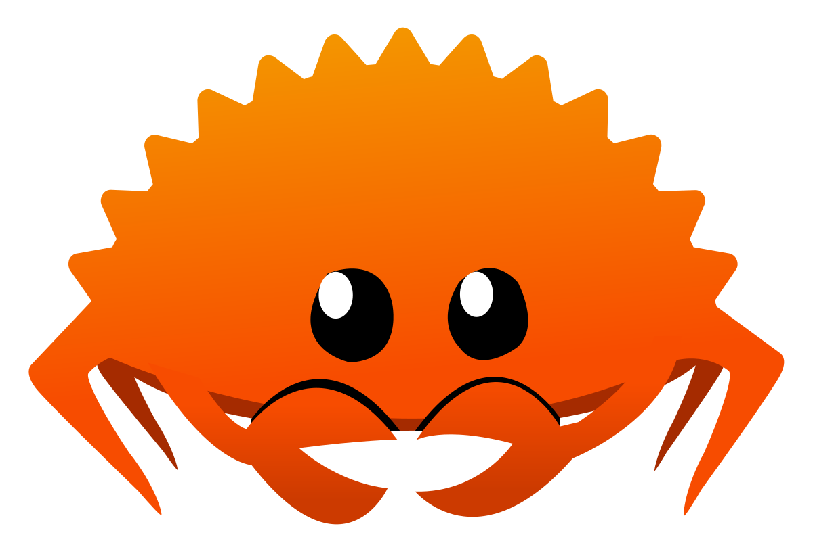
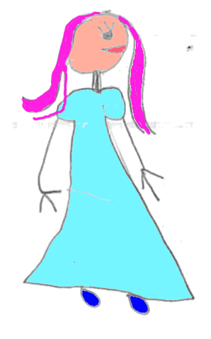
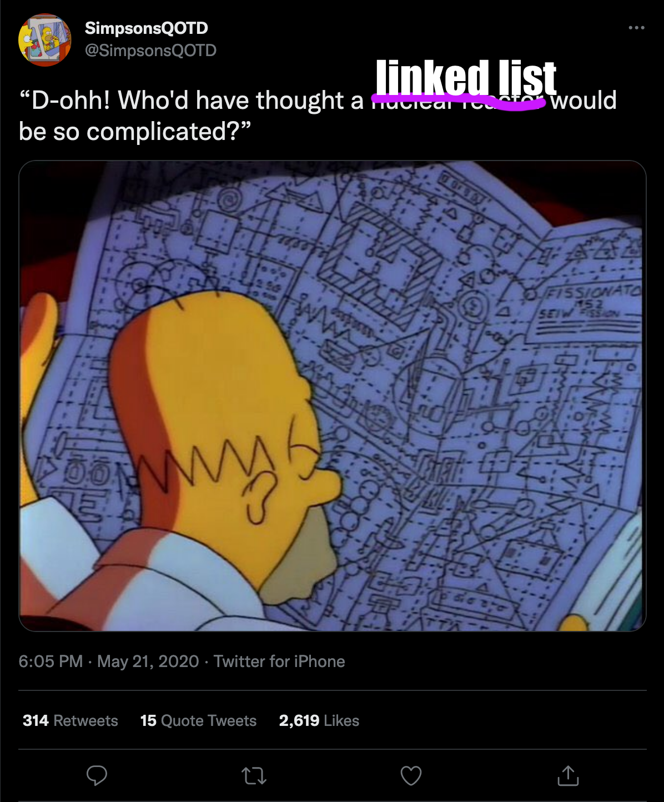

class: center
name: title
count: false

# Rust in 2024

.p60[]

.me[.grey[*by* **Nicholas Matsakis**]]
.left[.citation[View slides at `https://nikomatsakis.github.io/iFood-Tech-Day-2022/`]]

---

# Who is this guy

.text300[👋🏽 Hi!]

* Been working on Rust since 2011
* Co-lead of the Rust language design team
* Senior Principal Engineer at AWS

---

# Rust sprouting up all over

.center[.p80[]]

... and those are just the foundation sponsors.

---

# What is this "Rust"

From the website:

> A language empowering everyone to build reliable and efficient software.

---

# My goal

.center[
Make Rust the language of choice whenever

**reliability**

and

**performance**

are top considerations.
]

---

# Rust as the foundational layer

* Cloud providers like AWS, Microsoft, Google, Fastly, Cloudflare, etc

--


--

.p60[]

.citation[
    `https://aws.amazon.com/blogs/opensource/why-aws-loves-rust-and-how-wed-like-to-help/` <br/>
    `https://www.zdnet.com/article/microsofts-rust-experiments-are-going-well-but-some-features-are-missing/`
]

---

# Rust as the foundational layer

* Operating system kernels

--

.p60[]

--

.p60[]

.citation[
    `https://thenewstack.io/rust-in-the-linux-kernel-by-2023-linus-torvalds-predicts/` <br/>
    `https://www.zdnet.com/article/microsofts-rust-experiments-are-going-well-but-some-features-are-missing/`
]

---

# Rust as the foundational layer

* Embedded IoT

---

# Rust as the foundational layer

Stuff like...

* Cloud providers like AWS, Microsoft, Google, Fastly, Cloudflare, etc
* Operating system kernels
* Embedded IoT

--

...but also:

* Your web service that moves a lot of traffic, actually.
* The core logic of your mobile app that you'd like to share between Android and iOS.
* That nifty new idea you have for a game. 

---

# Most folks come for the performance

--


> Remarkably, we had only put very basic thought into optimization as the Rust version was written. **Even with just basic optimization, Rust was able to outperform the hyper hand-tuned Go version.** This is a huge testament to how easy it is to write efficient programs with Rust compared to the deep dive we had to do with Go.

.citation[
    `https://discord.com/blog/why-discord-is-switching-from-go-to-rust` (emphasis theirs)<br>
    *Caveat:* This article dates from 2020 and Go has improved their GC performance in the interim.
]

---

# But they stay for the safety

--

.center[]

---

# Safety == spinach

.p60[]

.citation[Image credit: Clyde Robinson `https://flickr.com/photos/crobj/3184283013/`]

---

background-image: url(images/popeye1.jpg)
background-size: contain

.white-text[
# Safety == POPEYE spinach!
]

.white-text[.citation[
Image credit: Salim Virji `https://www.flickr.com/photos/salim/8594532469/`
]]

---

# Don't take my word for it

Listen to Discord:

> Along with performance, Rust has many advantages for an engineering team. For example, **its type safety and borrow checker make it very easy to refactor code as product requirements change or new learnings about the language are discovered**. Also, the ecosystem and tooling are excellent and have a significant amount of momentum behind them.

.citation[`https://discord.com/blog/why-discord-is-switching-from-go-to-rust` (emphasis mine)]

---

# Don't take my word for it

Or pinecone.io:

> What we didn’t expect was the extent to which dev velocity increased and operational incidents decreased. **Dev velocity**, which was supposed to be the claim to fame of Python, **improved dramatically with Rust**. \[..\] Most impressively though, real time operational events dropped almost to zero overnight after the original release. Sure, there are still surprises here and there but, by and large, the core engine has been shockingly stable and predictable.

.citation[`https://www.pinecone.io/learn/inside-the-pinecone/#rust-a-hard-decision-pays-off` (emphasis mine)]

---

# Example: Mozilla and Stylo


???

Let me give you an example, one that comes from Mozilla. Mozilla is the company where Rust was created, of course, and I worked there for a long time. (I'm at AWS now.) Mozilla makes Firefox, the famous browser. A key part of a browser, of course, is the CSS styling system. If you're familiar with CSS, you know that the idea is to traverse the HTML and to determine how big each piece of text should be, whether it should be bold, where it should appear, etc.

--


.opened[]

???

So about 12 years ago, it was recognized that this could be done in parallel. In fact, it's an "embarassingly parallel" problem, which means that there is no coordination needed between the threads. Should be easy, though bz. If you know bz, you'll know the guy is a genius. He knows Firefox inside and out. If you read the thread, though, you'll see that not one but two distinct attempts were made in C++ over the years, and neither was successful. Each of them fell prey to various problems: some of them were bugs in the parallel logic, some of them were small variations between windows, mac, and linux that made the code not work, etc. At the end of the day, people felt that the benefits of the patch were not worth the maintenance burden of landing it.

--


.closed[]

???

The 3rd and final attempt used Rust, and had the codename stylo. This version landed -- though it too was a non-trivial effort, don't get me wrong! Using Rust helped to give the team confidence that they could not only make the code work, but they could maintain it over time. For one thing, the Rust type system helped them to find bugs and logic errors at compilation time, instead of having to test the heck out of the thing. So this was a clear case where Rust enabled the team, a group of hardened C++ experts, to do something they had not been able to achieve before.

---

# What makes the difference?

Rust has a lot of features that support productivity:

* Cargo: powerful package management
* Enums and matching
* No null pointers

But underlying them all is a core capability.

---

# Ownership and borrowing

.center[.p80[]]

---

name: every-language-lets-you-give

# Every language lets you give

```go
func foo() {
  regalo := Gift { .. }
  channel <- regalo
  regalo.open();
}
```

.gologo[

]

---

template: every-language-lets-you-give

.lover-left[

]

.line1[

]

---

template: every-language-lets-you-give

.lover-left[

]

.line2[

]

--

.lover-gift-left[

]

---

template: every-language-lets-you-give

.lover-left[

]

.line3[

]

.lover-gift-left[

]

--

.lover-right[

]

---

template: every-language-lets-you-give

.lover-left[

]

.line3[

]

.lover-gift-center[

]

.lover-right[

]

---

template: every-language-lets-you-give

.lover-left[

]

.lover-right[

]

.lover-gift-center[

]

.line4[

]

--

.lover-gift-center[

]

---

template: every-language-lets-you-give

.lover-left[

]

.lover-right[

]

.lover-gift-center[

]

.col-right[
```go
// The other goroutine
presente := <- channel
presente.open()
```
]

.line3r[

]

.lover-right[

]

--

.lover-right[

]

---

# What went wrong?

.lover-right[

]

Two ingredients:

- Mutation
- Sharing

--

Rust's solution:

- Support sharing and mutation
  - but **not at the same time**

---

name: rust-lets-you-take-away

# Rust lets you take away

```rust
fn main() {
  let regalo = Gift::new();
  channel.send(regalo);
  regalo.open();
}
```

---

template: rust-lets-you-take-away

.line1[]

.lover-left[]

---

template: rust-lets-you-take-away

.line2[]

.lover-left[]

.lover-gift-left[]

---

template: rust-lets-you-take-away

.line3[]

.lover-left[

]

.lover-gift-left[

]

---

name: rust-lets-you-take-away-2
template: rust-lets-you-take-away

.col-right[
```rust
impl<T> Channel<T> {
  fn send(&mut self, data: T) {
    ...
  }
}
```
]

---

template: rust-lets-you-take-away-2

.line1r[]
.lover-gift-left[]
.lover-left[]
.lover-right[]

---

template: rust-lets-you-take-away-2

.line1-impl[]
.lover-gift-left[]
.lover-left[]
.lover-right[]

---

template: rust-lets-you-take-away-2

.line1-generics[]
.lover-gift-left[]
.lover-left[]
.lover-right[]

---

template: rust-lets-you-take-away-2

.line2-data[]
.lover-gift-left[]
.lover-left[]
.lover-right[]

--

.line3-regalo[]

---

template: rust-lets-you-take-away-2

.line2-data[]
.line3-regalo[]
.lover-gift-right[]
.lover-left[]
.lover-right[]

---

template: rust-lets-you-take-away

.line4[]
.lover-left[]

---

template: rust-lets-you-take-away

.line4[]

```
error[E0382]: use of moved value: 'regalo'
  --> src/main.rs:13:4
     |
  12 |    channel.send(regalo)
     |                 ------ `value moved here`
  13 |    regalo.open();
     |    ^^^^^^ `value used here after move`
```

<!--

https://play.rust-lang.org/?version=stable&mode=debug&edition=2018&gist=4a87aac56936416fa95efa811266ce88

-->

---

# A pattern

- Easy to **expose** a high-performance API
- Hard to **help users control it**

.center[]

---

# Design goals for Rust

| | |
| --- | --- |
| ⚙️ Reliable | "If it compiles, it works" |
| 🐎 Performant | "idiomatic code runs efficiently" |
| 🥰 Supportive | "the language, tools, and community are here to help" |
| 🧩 Productive | "a little effort does a lot of work" |
| 🔧 Transparent | "you can predict and control low-level details" |
| 🤸 Versatile | "you can do anything with Rust" |

.citation[Caveat: These are goals that some of us drafted, not official design goals of the Rust project.]

---

# A common sensation

--

.center[.p80[]]

---

# This could be you

.center[.p80[]]

---

# Full disclosure time

--

.center[]

---

# What we're shooting for

```
 ^  |
 |  |
 P  │ C++                   
 e  │ 
 r  │ 
 f  │ 
 o  │ 
 r  │ 
 m  │ 
 a  │ 
 n  │ 
 c  │ 
 e  │ 
    │                           JS, Ruby, Python
    └─────────────────────────────────
           Ease of use -->
```

.bam-rust[
  
]

---

# Where we landed

```
 ^  |
 |  |
 P  │ C++   
 e  │       
 r  │       
 f  │       
 o  │       
 r  │       
 m  │       
 a  │       
 n  │       
 c  │        
 e  │        
    │                           JS, Ruby, Python
    └─────────────────────────────────
           Ease of use -->
```

.transparent[
.bam-rust[
  
]
]

.whimper-rust[
  
]

---

# OMG so perfect

<br/>
<br/>
<br/>

<q>Rust: the language where you get the hangover first</q>

-- Old Rust proverb <sup>1</sup>

.citation[
  <sup>1</sup> I've yet to find the origin of this quote.<sup>2</sup> <br/>
  <sup>2</sup> Although I have a sneaking suspicion that somebody tweeted it at me and I forgot.
]

---

# Rust rocks 🎸...

???

The fact is, Rust really rocks...

--

## ...once you learn it 😬

???

...once you learn it! But that can be quite difficult.

---

# So where do we go from here?
