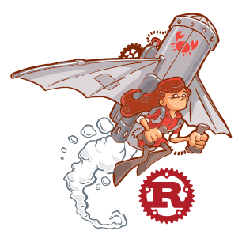

class: center
name: title
count: false

# Rust in 2024

.p60[]

.me[.grey[*by* **Nicholas Matsakis**]]
.left[.citation[View slides at `https://nikomatsakis.github.io/iFood-Tech-Day-2022/`]]

---

# Who is this guy

.text300[👋🏽 Hi!]

* Been working on Rust since 2011
* Co-lead of the Rust language design team
* Senior Principal Engineer at AWS

---

# Rust sprouting up all over

.center[.p80[]]

... and those are just the foundation sponsors.

---

# What is this "Rust"

From the website:

> A language empowering everyone to build reliable and efficient software.

---

# When should I use it?

From the website:

> A language empowering everyone to build **reliable and efficient software**.

Rust's design assumes you're want to invest the time to make your software more reliable, more efficient.

.citation[
  Doesn't mean you can't use it for anything and everything, mind you. 😁
]

---

# But also...

From the website:

> A language **empowering everyone** to build reliable and efficient software.

Rust is meant to be accessible and productive.

---

# The goal is simple

.center[
  .p40[
    
  ]
]

.center[Hack without fear!]

.citation[
  RustConf 2017 artwork owned by [Tilde](https://www.tilde.io/) and licensed under Creative Commons.

  Slogan coined by Felix Klock.
]

---

# Rust as the foundational layer

* Cloud providers like AWS, Microsoft, Google, Fastly, Cloudflare, etc

--


.p60[]

.citation[
    `https://aws.amazon.com/blogs/opensource/why-aws-loves-rust-and-how-wed-like-to-help/` <br/>
    `https://www.zdnet.com/article/microsofts-rust-experiments-are-going-well-but-some-features-are-missing/`
]

---

# Rust as the foundational layer

* Operating system kernels

--

.p60[]

.p60[]

.citation[
    `https://thenewstack.io/rust-in-the-linux-kernel-by-2023-linus-torvalds-predicts/` <br/>
    `https://www.zdnet.com/article/microsofts-rust-experiments-are-going-well-but-some-features-are-missing/`
]

---

# Rust as the foundational layer

* Embedded IoT

---

# Rust as the foundational layer

Stuff like...

* Cloud providers like AWS, Microsoft, Google, Fastly, Cloudflare, etc
* Operating system kernels
* Embedded IoT

--

...but also:

* Your web service that moves a lot of traffic, actually.
* The core logic of your mobile app that you'd like to share between Android and iOS.
* Development tools that need to run fast. 

---

# Most folks come for the performance

--

.p60[]

> Remarkably, we had only put very basic thought into optimization as the Rust version was written. **Even with just basic optimization, Rust was able to outperform the hyper hand-tuned Go version.** This is a huge testament to how easy it is to write efficient programs with Rust compared to the deep dive we had to do with Go.

.citation[
    `https://discord.com/blog/why-discord-is-switching-from-go-to-rust` (emphasis theirs)<br>
    *Caveat:* This article dates from 2020 and Go has improved their GC performance in the interim.
]

---

# But then they fall in love

But look at what comes next:

> Along with performance, Rust has many advantages for an engineering team. For example, **its type safety and borrow checker make it very easy to refactor code as product requirements change or new learnings about the language are discovered**. Also, the ecosystem and tooling are excellent and have a significant amount of momentum behind them.

.citation[`https://discord.com/blog/why-discord-is-switching-from-go-to-rust` (emphasis mine)]

---

# It's not just discord

Or pinecone.io:

> What we didn’t expect was the extent to which dev velocity increased and operational incidents decreased. **Dev velocity**, which was supposed to be the claim to fame of Python, **improved dramatically with Rust**. \[..\] Most impressively though, real time operational events dropped almost to zero overnight after the original release. Sure, there are still surprises here and there but, by and large, the core engine has been shockingly stable and predictable.

.citation[`https://www.pinecone.io/learn/inside-the-pinecone/#rust-a-hard-decision-pays-off` (emphasis mine)]

---

# It's not just discord

Or Cultivate:

> "Rust allowed the experienced developers to move fast and develop features quickly with less errors, and allowed those exploring systems development for the first time to **move forward with confidence, curiosity and protection** from the "gotchas" of C/C++."

.citation[`https://cultivatehq.com/posts/how-we-built-a-visual-studio-code-extension-for-iot-prototyping/` (emphasis mine)]

---

# What is the key to this confidence?

--

A strict (and sometimes annoying) type system!

--

.center[
  .p60[]
]

---

# Safety == spinach

.p60[]

.citation[Image credit: Clyde Robinson `https://flickr.com/photos/crobj/3184283013/`]

---

background-image: url(images/popeye1.jpg)
background-size: contain

.white-text[
# Safety == POPEYE spinach!
]

.white-text[.citation[
Image credit: Salim Virji `https://www.flickr.com/photos/salim/8594532469/`
]]

---

# Example: Mozilla and Stylo


???

Let me give you an example, one that comes from Mozilla. Mozilla is the company where Rust was created, of course, and I worked there for a long time. (I'm at AWS now.) Mozilla makes Firefox, the famous browser. A key part of a browser, of course, is the CSS styling system. If you're familiar with CSS, you know that the idea is to traverse the HTML and to determine how big each piece of text should be, whether it should be bold, where it should appear, etc.

--


.opened[]

???

So about 12 years ago, it was recognized that this could be done in parallel. In fact, it's an "embarassingly parallel" problem, which means that there is no coordination needed between the threads. Should be easy, though bz. If you know bz, you'll know the guy is a genius. He knows Firefox inside and out. If you read the thread, though, you'll see that not one but two distinct attempts were made in C++ over the years, and neither was successful. Each of them fell prey to various problems: some of them were bugs in the parallel logic, some of them were small variations between windows, mac, and linux that made the code not work, etc. At the end of the day, people felt that the benefits of the patch were not worth the maintenance burden of landing it.

--


.closed[]

???

The 3rd and final attempt used Rust, and had the codename stylo. This version landed -- though it too was a non-trivial effort, don't get me wrong! Using Rust helped to give the team confidence that they could not only make the code work, but they could maintain it over time. For one thing, the Rust type system helped them to find bugs and logic errors at compilation time, instead of having to test the heck out of the thing. So this was a clear case where Rust enabled the team, a group of hardened C++ experts, to do something they had not been able to achieve before.

---

# What makes the difference?

Rust has a lot of features that support productivity:

* Cargo: powerful package management
* Enums and matching
* No null pointers

But underlying them all is a core capability.

---

# Ownership and borrowing

.center[.p80[]]

---

name: every-language-lets-you-give

# Every language lets you give

```go
func foo() {
  regalo := Gift { .. }
  channel <- regalo
  regalo.open();
}
```

.gologo[

]

---

template: every-language-lets-you-give

.lover-left[

]

.line1[

]

---

template: every-language-lets-you-give

.lover-left[

]

.line2[

]

--

.lover-gift-left[

]

---

template: every-language-lets-you-give

.lover-left[

]

.line3[

]

.lover-gift-left[

]

--

.lover-right[

]

---

template: every-language-lets-you-give

.lover-left[

]

.line3[

]

.lover-gift-center[

]

.lover-right[

]

---

template: every-language-lets-you-give

.lover-left[

]

.lover-right[

]

.lover-gift-center[

]

.line4[

]

--

.lover-gift-center[

]

---

template: every-language-lets-you-give

.lover-left[

]

.lover-right[

]

.lover-gift-center[

]

.col-right[
```go
// The other goroutine
presente := <- channel
presente.open()
```
]

.line3r[

]

.lover-right[

]

--

.lover-right[

]

---

# What went wrong?

.lover-right[

]

Two ingredients:

- Mutation
- Sharing

--

Rust's solution:

- Support sharing and mutation
  - but **not at the same time**

---

name: rust-lets-you-take-away

# Rust lets you take away

```rust
fn main() {
  let regalo = Gift::new();
  channel.send(regalo);
  regalo.open();
}
```

---

template: rust-lets-you-take-away

.line1[]

.lover-left[]

---

template: rust-lets-you-take-away

.line2[]

.lover-left[]

.lover-gift-left[]

---

template: rust-lets-you-take-away

.line3[]

.lover-left[

]

.lover-gift-left[

]

---

name: rust-lets-you-take-away-2
template: rust-lets-you-take-away

.col-right[
```rust
impl<T> Channel<T> {
  fn send(&mut self, data: T) {
    ...
  }
}
```
]

---

template: rust-lets-you-take-away-2

.line1r[]
.lover-gift-left[]
.lover-left[]
.lover-right[]

---

template: rust-lets-you-take-away-2

.line1-impl[]
.lover-gift-left[]
.lover-left[]
.lover-right[]

---

template: rust-lets-you-take-away-2

.line1-generics[]
.lover-gift-left[]
.lover-left[]
.lover-right[]

---

template: rust-lets-you-take-away-2

.line2-data[]
.lover-gift-left[]
.lover-left[]
.lover-right[]

--

.line3-regalo[]

---

template: rust-lets-you-take-away-2

.line2-data[]
.line3-regalo[]
.lover-gift-right[]
.lover-left[]
.lover-right[]

---

template: rust-lets-you-take-away

.line4[]
.lover-left[]

---

template: rust-lets-you-take-away

.line4[]

```
error[E0382]: use of moved value: 'regalo'
  --> src/main.rs:13:4
     |
  12 |    channel.send(regalo)
     |                 ------ `value moved here`
  13 |    regalo.open();
     |    ^^^^^^ `value used here after move`
```

<!--

https://play.rust-lang.org/?version=stable&mode=debug&edition=2018&gist=4a87aac56936416fa95efa811266ce88

-->

---

# A pattern

- Easy to **expose** a high-performance API
- Hard to **help users control it**

.center[]

---

# Design goals for Rust

| | |
| --- | --- |
| ⚙️ Reliable | "If it compiles, it works" |
| 🐎 Performant | "idiomatic code runs efficiently" |
| 🥰 Supportive | "the language, tools, and community are here to help" |
| 🧩 Productive | "a little effort does a lot of work" |
| 🔧 Transparent | "you can predict and control low-level details" |
| 🤸 Versatile | "you can do anything with Rust" |

.citation[Caveat: These are goals that some of us drafted, not official design goals of the Rust project.]

---

# A common sensation

--

.center[.p80[]]

---

# This could be you

.center[.p80[]]

---

# Full disclosure time

--

.center[]

---

# What we're shooting for

```
 ^  |
 |  |
 P  │ C++                   
 e  │ 
 r  │ 
 f  │ 
 o  │ 
 r  │ 
 m  │ 
 a  │ 
 n  │ 
 c  │ 
 e  │ 
    │                           JS, Ruby, Python
    └─────────────────────────────────
           Ease of use -->
```

.bam-rust[
  
]

---

# Where we landed

```
 ^  |
 |  |
 P  │ C++   
 e  │       
 r  │       
 f  │       
 o  │       
 r  │       
 m  │       
 a  │       
 n  │       
 c  │        
 e  │        
    │                           JS, Ruby, Python
    └─────────────────────────────────
           Ease of use -->
```

.transparent[
.bam-rust[
  
]
]

.whimper-rust[
  
]

---

# OMG so perfect

<br/>
<br/>
<br/>

<q>Rust: the language where you get the hangover first</q>

-- Old Rust proverb <sup>1</sup>

.citation[
  <sup>1</sup> I've yet to find the origin of this quote.<sup>2</sup> <br/>
  <sup>2</sup> Although I have a sneaking suspicion that somebody tweeted it at me and I forgot.
]

---

# Rust rocks 🎸...

???

The fact is, Rust really rocks...

--

## ...once you learn it 😬

???

...once you learn it! But that can be quite difficult.

---

# Our challenge

* Stay true to Rust's soul: reliability, performance, transparency
* While improving Rust's supportiveness, productivity, and versatility

???

Our challenge is to find ways to improve Rust's productivity while staying true to the things that make Rust Rust.

It's not always easy. There are a few dangers.

Complacency.

Overreach and leaky abstractions.

Goal: incremental progress. Find our way.

---

# Another challenge: being bold

<q>Avoid success at all costs</q>

-- Unofficial Haskell slogan

???

Haskellers often say they wish to "avoid success at all costs".

Why? Because they want the freedom to keep innovating.

With success comes the problems of backwards compatibility and the challenges of satisfying an existing set of users.

Rust has achieved success. But I still want us to soar.

How do we do that? Part of is that we have to *be bold*.

Just because something seems hard, or because we've always done it that way, doesn't mean we should.

I'm going to give a few examples of hard problems in this talk -- ones that I think are controversial, but which have real impact on Rust's users.

---

# Rust learning curve

Q: When is a Rust user most open to learning how Rust works?

--
* When they're reading the Rust book for the first time?

--
* Once they know things work?

---

# Rust learning curve

Q: When is a Rust user most open to learning how Rust works?

A: when they hit a compiler error!

```
error: return types are denoted using `->`
 --> src/main.rs:1:21
  |
1 | fn meaning_of_life(): u32 { 42 }
  |                     ^ help: use `->` instead
```

---

# Rust learning curve

Q: What is the first thing a Rust user has to know to understand the error?

--
* The Rust type system?

--
* Ownership and borrowing

---

# Rust learning curve

Q: What is the first thing a Rust user has to know to understand the error?

A: English.

---

# Diagnostic translation effort

.p40[]

```
error: el tipo de retorno se debe indicar mediante `->`
 --> src/main.rs:1:21
  |
1 | fn meaning_of_life(): u32 { 42 }
  |                     ^ ayuda: utilice `->` en su lugar
```

.citation[
  Shoutout to David Wood and the folks from Diagnostics Working Group driving this effort.<br/>
  Read more at https://blog.rust-lang.org/inside-rust/2022/08/16/diagnostic-effort.html.
]

---

# Helping people learn in other ways

.center[.p80[]]

---

# Learning more about how people learn Rust?


---

# Being bold: Telemetry?

* It would be really useful if we knew
  * what error codes people hit
  * what they do in response to those errors
  * how many people are hitting a bug that was just reported
* But:
  * If we were to do this, have to be careful to respect privacy

---

# Async Rust

Async-await shipped in 2019...

```rust
async fn send_message(
  input: Reader,
  output: Writer,
) -> io::Result<()> {
  let data = input.read_data().await?;
  output.write_data(data).await?;
}
```

...and it's sparked an explosion in network-related Rust apps.

---

name: async-needs-work

# Async Rust needs work

```rust
trait Iterator {
  type Item;

  fn next(&mut self) -> Option<Self::Item>;
}
```

---
template: async-needs-work

.line2[]

---
template: async-needs-work

.line4[]

---

# Async Rust needs work

```rust
trait Iterator {
  type Item;

  fn next(&mut self) -> Option<Self::Item>;
}
```

Q: What does the async version of the `Iterator` trait look like?

---

# Async Rust needs work

A: There isn't one! Because async doesn't work in traits.

---

# Async fns in traits

```rust
pub trait AsyncIterator {
    type Item;

    async fn next(&mut self) -> Option<Self::Item>;
}
```

This is what we are shooting for.

.line4[]

---

# Async fns in traits

Current status:

* ✅ Design: approaching completion
* ✏️ Implementation: ongoing
* ⌛ Stablization: next year

.citation[
  Shoutout to Tyler Mandry, who worked on the design with me,
  as well as Santiago Pastorino, Eric Holk, Michael Goulet,
  but also Jack Huey for his work on GATs and Oli Scherer for
  his work on TAITs. It takes a village.
]


---

# Other async Rust language features


.citation[
  <sup>1</sup> The code that runs when a variable goes out of scope (aka, destructors).
]

* Goal: use async/await anywhere you write code
  * ✅ top-level async fns
  * ✏️ async fn in traits
  * ⌛ async drop<sup>1</sup>
  * ⌛ async closures

--
  * 🤔 in iterator chains?

---

name: iterator-chain

# Iterator chains?

```rust
fn find_element(data: &[Data]) -> Result {
  x.iter()
      .filter(|datum| datum.is_valid())
      .map(|datum| datum.intermediate_result())
      .max()
}
```

---

template: iterator-chain

.line2[]

---

template: iterator-chain

.line3[]

---

template: iterator-chain

.line4[]

---

template: iterator-chain

.line5[]

---

# Iterator chains with await

```rust
fn find_element(data: &[Data]) -> Result {
  x.iter()
      .filter(|datum| datum.is_valid())
      .map(|datum| datum.intermediate_result().await)
      .max()
}
```

--

.line4[]

---

# "Color" problem<sup>1</sup>

No way to write a function that *might* be async.

Do we need to make two iterators? 

What if we to support `const fn`, do we need three?

(For folks who know Rust, what about if we want to support `?` -- do we need four?)

.citation[
  <sup>1</sup> The term "color" comes from the classic blog post, ["What color is your function?"](https://journal.stuffwithstuff.com/2015/02/01/what-color-is-your-function/), describing a similar phenomena in JavaScript.
]

---

name: keyword-generics

# Being bold: "keyword" generics

```rust
async<A> fn read_to_string(
  reader: &mut impl Read * A,
) -> std::io::Result<String> {
    let mut string = String::new();
    reader.read_to_string(&mut string).await?;
    string
}
```

Goal: Write code that might be async, might be const, etc.

.citation[
  Led by Yoshua Wuyt and Oli Scherer. Read more: https://blog.yoshuawuyts.com/announcing-the-keyword-generics-initiative/
]

---

template: keyword-generics

.line1[]

---

template: keyword-generics

.line2[]

---

# Conclusion

Rust's goal:

Be the language of choice when reliability, performance are top considerations.

